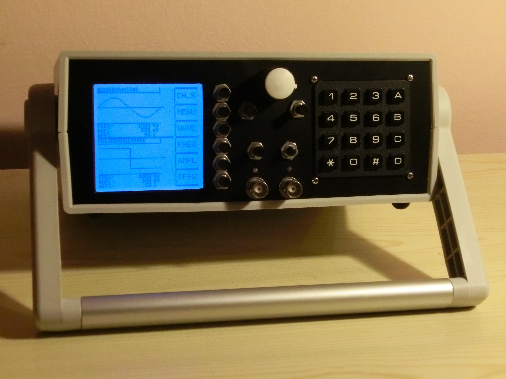
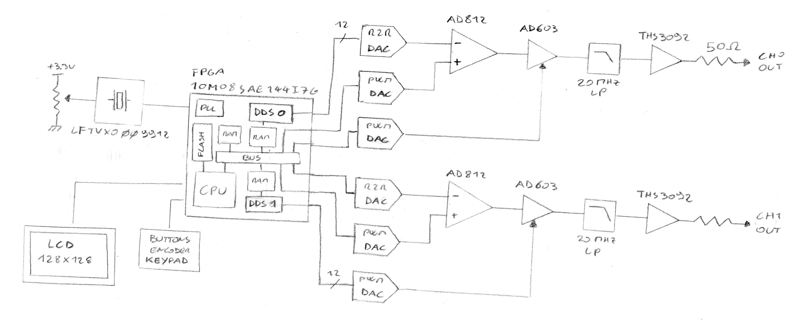
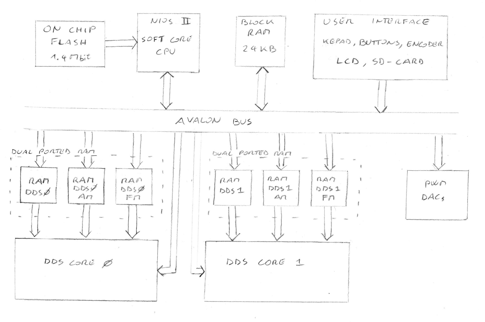
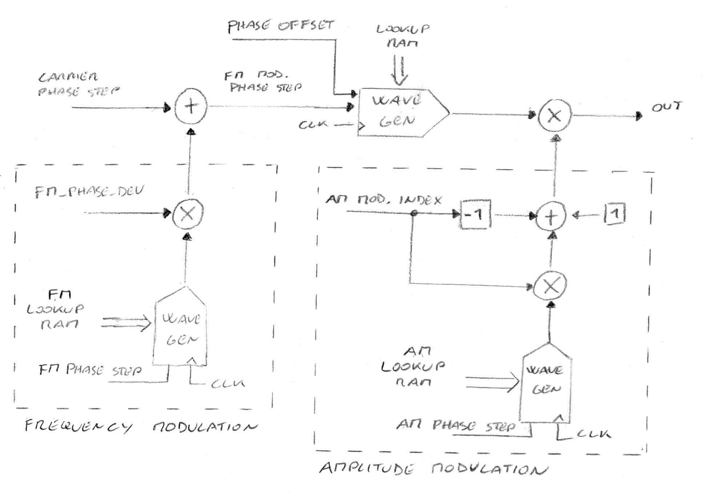
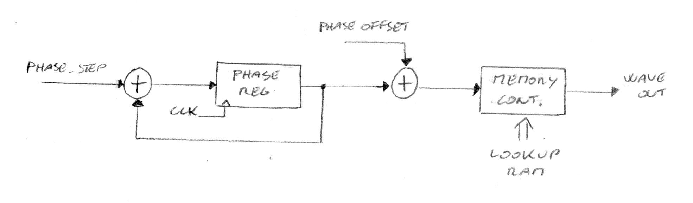

# DDS Function Generator

<!-- TABLE OF CONTENTS -->

  
Table of Contents

  <ol>
    <li>
      <a href="#about-the-project">About The Project</a>
    </li>
    <li>
      <a href="#getting-started">Getting Started</a>
      <ul>
        <li><a href="#prerequisites">Prerequisites</a></li>
        <li><a href="#compiling-code-for-the-cpu">Compiling code for the CPU</a></li>
        <li><a href="#how-to-program-the-fpga">How to program the FPGA</a></li>
      </ul>
    </li>
    <li>
        <a href="#theory-of-operation">Theory of Operation</a>
        <ul>
            <li><a href="#block-diagram">Block Diagram</a></li>
            <li><a href="#fpga-internal-structure">FPGA Internal Structure</a></li>
            <li><a href="#dds-core">DDS Core</a></li>
            <li><a href="#wave-generator">Wave Generator</a></li>
        </ul>
    </li>
    <li><a href="#future-improvements">Future Improvements</a></li>
    <li><a href="#references">References</a></li>
    <li><a href="#disclaimer">Disclaimer</a></li>
  </ol>

<!-- ABOUT THE PROJECT -->
## About The Project
This project is a dual-channel function generator. Waveforms are generated digitally inside an FPGA via DDS ([Direct Digital Synthesis](https://www.analog.com/en/analog-dialogue/articles/all-about-direct-digital-synthesis.html)). The main purpose of this project was to get familiar with FPGAs and at the same time build something useful to have in the lab.

* Frequency DC to 20Mhz
* Power 28 dBm - 6Vrms into 50 Ohms
* Output waveforms: square, triangle, sawtooth, sine, wave file from SD card
* Independent AM and FM modulation on both channels
* Frequency Sweep
* Programmable phase offset between channels

<!-- GETTING STARTED -->
## Getting Started
### Prerequisites
* [Quartus 18.1](https://fpgasoftware.intel.com/18.1/?edition=lite) with `MAX 10 FPGA device support`

### Compiling code for the CPU
* Open Quartus, click on `Tools > Nios II Software Build Tools for Eclipse`
* Select a folder to be used as a workspace (make sure the path has no spaces)
* Click on `File > Import`
* Select `General > Existing Project into Workspace` then click next
* Browse for the folder `fpga/software` select both projects and click finish
* right-click on `DDS_FunctionGen_20Mhz_bsp` than on `Nois II > Generate BSP`
* Now to build the project right-click on `DDS_FunctionGen_20Mhz` than click on `Build Project`
* To generate the FPGA FLASH initialization file, right-click on `DDS_FunctionGen_20Mhz` then click `Make Targets > Build`, select `mem_init_generate` and press `Build`

### How to program the FPGA
* Open the project file `fpga/DDS_FunctionGenerator_20Mhz.qpf` with Quartus
* Press `Compile Design`

<!-- BLOCK DIAGRAM -->
## Theory of Operation
This section gives a basic overview of the main components and how they interact.

### Block Diagram

The driver of the show is the FPGA, it's a `10M08SAE144I7G` from the Altera MAX10 Series. MAX10 devices are cool because they have a built-in configuration flash memory and some UFM (User Flash Memory) that can be written when the FPGA is programmed to store non-volatile data. This project uses the UFM to store code for the CPU.\
The clock is provided by a 10Mhz TCXO oscillator, a potentiometer connected to the adj. pin is used to adjust the frequency.\
First, the signal is generated digitally inside the FPGA, then it goes into a 12bit R2R DAC that converts it to an analog voltage. The signal then passes through an inverting op-amp where a DC offset is added. After that, there's a VGA to control the output level. The signal is then filtered by an active op-amp filter before entering the final amplifier.

### FPGA Internal Structure

This block diagram describes the interaction between modules inside the FPGA. All components are memory-mapped on the same bus and are all controlled by the CPU. The CPU is a NIOS II Soft Core provided by Altera, it executes code directly from FLASH. It handles all the user interface stuff like responding to button presses, updating the screen and talking to the SD card.\
The second main module is the DDS Core, there are two of them, one for each channel.
The DDS Core is responsible for the generation of the output waveform. Each DDS Core interfaces whit the CPU through three look-up RAMs and a control bus. Waveform parameters like frequency, modulation depth, etc. are set via the control bus. Waveform shape is controlled by the look-up RAM. The CPU can update the look-up RAM content at any time. When a wave file is played, the CPU loads samples from the SD Card into the proper look-up RAM. The output frequency is set equal to the wave file sample frequency therefore, the DDS Core reads one sample at a time from memory and reconstructs the signal. When half of the samples are consumed an interrupt is triggered and the CPU replaces that half with new data.

### DDS Core

This module is a wrapper around three `Wave Generator` modules. One of them is used to generate the main waveform, the others are for frequency and amplitude modulation. The `CARRIER_PHASE_STEP` input is the frequency of the unmodulated waveform, a signal is added to it to achieve frequency modulation. Amplitude modulation is applied to the signal at the end.

### Wave Generator

This module takes samples from a look-up RAM and outputs a waveform. Frequency is selected with the `PHASE_STEP` input. The `PHASE_OFFSET` input adds a phase offset to the waveform. The memory controller looks at the current phase to generate the appropriate address to index the look-up RAM.

<!-- FUTURE IMPROVEMENTS -->
## Future Improvements
* Add a cache memory between CPU and FLASH. Without that code runs slow and the user interface is not super responsive.
* Upgrade to a bigger FPGA with more UFM. UFM is too small to fit any more code, thus the SD card functions can't be fully implemented.
* Use a proper DAC IC. The R2R DACs are inadequate, even with 0.1% resistors the nonlinearity is too much.

<!-- REFERENCES -->
## References
* [FatFs - Generic FAT Filesystem Module](http://elm-chan.org/fsw/ff/00index_e.html)
* [All About Direct Digital Synthesis - Analog Devices](https://www.analog.com/en/analog-dialogue/articles/all-about-direct-digital-synthesis.html)
* [Fundamentals of Direct Digital Synthesis (DDS) - Analog Devices](https://www.analog.com/media/en/training-seminars/tutorials/MT-085.pdf)

<!-- DISCLAIMER -->
## Disclaimer
The following project is shared "as is", with the sole objective of being useful. The creator of the described piece of hardware and its associated software cannot guarantee its correct functioning under any circumstance. The author of this project will not be held responsible for any material, personal or economic losses to you or any third parties that may arise from using this design. This project will not be used under any circumstances on systems whose responsibility is critical, or from which people's lives depend upon, directly or indirectly.